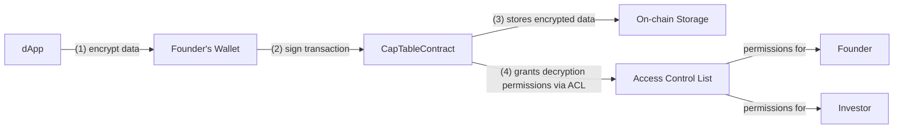
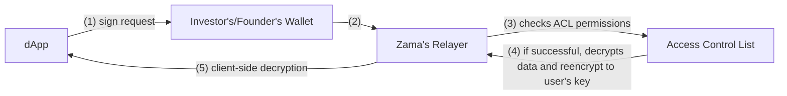

# Fairmint OCP Fork + PrivateStockFacet (FHE)

This repository is a fork of Open Cap Table Protocol (https://github.com/Open-Captable-Protocol/ocp) augmented with a new facet, `PrivateStockFacet`, that demonstrates Fully Homomorphic Encryption (FHE) for confidential allocations. Using Zama Protocol (FHEVM) toolchain, we store and compute on encrypted values (shares, price/share, investment) while preserving role‑based access for founders and investors and keeping public views privacy‑safe.

## Repository layout

- **`chain/`** — Fairmint Diamond contracts plus the new `PrivateStockFacet` (Hardhat + `@fhevm/solidity`).
- **`demo-frontend/`** — Next.js demo app; integrates `privateStockFacetAbi` and Zama Relayer SDK.

## Setup and test guides

- Contracts (Hardhat + FHE): see `chain/README.md` for install, compile, test, and deploy steps → [Contracts setup guide](chain/README.md)
- Frontend (Next.js + Relayer SDK): see `demo-frontend/README.md` for install, run, and usage → [Frontend setup guide](demo-frontend/README.md)

## What this includes

- **Encrypted allocations:** shares and price/share are stored as encrypted integers and multiplied homomorphically for investment amounts.
- **Role‑based visibility:** founders and admin can decrypt all allocations; investors can decrypt only their own; the public cannot decrypt.
- **Per‑position access control:** decryption permissions are granted per security position using Zama’s access control primitives ([ACL documentation](https://docs.zama.ai/protocol/solidity-guides/smart-contract/acl)).

### Smart contracts (new facet)

- **`chain/src/facets/PrivateStockFacet.sol`** (new)
  - `initialize()` — configures FHE coprocessor and decryption oracle
  - `issuePrivateStocks(IssuePrivateStockParams[] params, bytes inputProof)` — issues encrypted positions; grants viewing permissions to founder, investor and admin
  - `getPrivateStockPosition(bytes16 securityId)` — returns an encrypted position
  - `getPrivateStakeholderSecurities(address stakeholder, bytes16 stock_class_id)` — lists security IDs for a stakeholder

Related interfaces and structs:
- **`chain/src/interfaces/IPrivateStockFacet.sol`** — facet interface
- **`chain/src/libraries/Structs.sol`** — `PrivateStockActivePosition`, `IssuePrivateStockParams`
- **`chain/src/core/Storage.sol`** — persistent storage for private positions

## How FHE integration works (high‑level)

The contracts rely on Zama's FHEVM to perform arithmetic on encrypted integers (`euint64`) and to enforce read permissions. There are two distinct flows:

### 1. Stock Issuance Flow

When issuing new stock positions, the flow is:

**Process:**
1. dApp locally encrypts stock data. 
2. dApp requests founder's wallet to sign a transaction containing encrypted stock data and send it on-chain
3. CapTableContract stores the encrypted data on-chain
4. CapTableContract grants decryption permissions to founder and investor using Zama's ACL

### 2. Position Viewing Flow

When viewing stock positions, the flow is:

**Process:**
1. dApp requests investor's (or founder's) wallet to sign a request to Zama's relayer
2. Relayer forwards request to Zama's relayer
3. Zama's protocol checks ACL permissions for the requesting address
4. If successful, protocol decrypts the data by reencrypting it to the user's key
5. Data is returned to dApp and decrypted client-side

### Key Technical Details

- **Encrypted types:** values are stored and computed as `euint64` via `@fhevm/solidity`.
- **Homomorphic compute:** ciphertext multiplication/addition; plaintext is never revealed on‑chain.
- **Access control:** `FHE.allow` grants per‑address visibility during issuance. ACL is checked during viewing.
- **Sealed outputs:** authorized reads return sealed ciphertexts to be opened by the viewer through the Zama relayer/oracle flow.

## Running locally

Prerequisites:
- Node.js 18+
- pnpm or yarn
- Docker (for optional local services)
