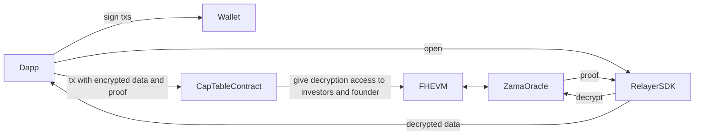

# Fairmint OCP Fork + PrivateStockFacet (FHE)

This repository is a fork of Fairmint’s Open Cap Table Protocol (Diamond architecture) augmented with a new facet, `PrivateStockFacet`, that demonstrates Fully Homomorphic Encryption (FHE) for confidential allocations. Using Zama’s FHEVM toolchain, we store and compute on encrypted values (shares, price/share, investment) while preserving role‑based access for founders and investors and keeping public views privacy‑safe.

## Repository layout

- **`chain/`** — Fairmint Diamond contracts plus the new `PrivateStockFacet` (Hardhat + `@fhevm/solidity`).
- **`demo-frontend/`** — Next.js demo app; integrates `privateStockFacetAbi` and Zama Relayer SDK.


## What this includes

- **Encrypted allocations:** shares and price/share are stored as encrypted integers and multiplied homomorphically for investment amounts.
- **Role‑based visibility:** founders can decrypt all allocations; investors can decrypt only their own; the public cannot decrypt.
- **Per‑position access control:** decryption permissions are granted per security position using Zama’s access control primitives.


### Smart contracts (new facet)

- **`chain/src/facets/PrivateStockFacet.sol`** (new)
  - `initialize()` — configures FHE coprocessor and decryption oracle
  - `issuePrivateStocks(IssuePrivateStockParams[] params, bytes inputProof)` — issues encrypted positions; grants viewing permissions to founder and the investor
  - `getPrivateStockPosition(bytes16 securityId)` — returns an encrypted position
  - `getPrivateStakeholderSecurities(address stakeholder, bytes16 stock_class_id)` — lists security IDs for a stakeholder

Related interfaces and structs:
- **`chain/src/interfaces/IPrivateStockFacet.sol`** — facet ABI
- **`chain/src/libraries/Structs.sol`** — `PrivateStockActivePosition`, `IssuePrivateStockParams`
- **`chain/src/core/Storage.sol`** — persistent storage for private positions


## How FHE works here (high‑level)

The contracts rely on Zama’s FHEVM to perform arithmetic on encrypted integers (`euint64`) and to enforce read permissions. Conceptually:



- **Encrypted types:** values are stored and computed as `euint64` via `@fhevm/solidity`.
- **Homomorphic compute:** ciphertext multiplication/addition; plaintext is never revealed on‑chain.
- **Access control:** `FHE.allow` grants per‑address visibility (founder and investor). Unprivileged callers get ciphertexts only.
- **Sealed outputs:** authorized reads return sealed ciphertexts to be opened by the viewer through the Zama relayer/oracle flow.


## FHE basics

Fully Homomorphic Encryption (FHE) lets you compute on encrypted data without ever decrypting it on-chain. In this repo:

- Plaintext (normal numbers) is encrypted in the browser/SDK. The blockchain only sees ciphertexts.
- Smart contracts can add/multiply encrypted numbers and store the results still encrypted.
- Only addresses explicitly granted access by the contract can decrypt specific values client-side.

### Key concepts

- **Plaintext**: the original value (e.g., 100 shares, $2.50 price/share).
- **Ciphertext**: the encrypted form stored on-chain (looks like random bytes).
- **Homomorphic operation**: arithmetic performed on ciphertexts (e.g., multiply shares × price) producing an encrypted result.
- **Sealed output**: an encrypted value “sealed” for a specific viewer so only that viewer can open it via the SDK.
- **Access control**: on-chain permissions (with `FHE.allow`) that determine who is allowed to decrypt which values.

### What stays private vs public

- **Private**: per-investor allocation amounts (shares, price/share, derived totals). These are returned as ciphertexts and only decryptable by permitted viewers.
- **Public**: non-sensitive metadata (addresses, IDs) and transaction existence. Note that gas usage and event timestamps remain public like any EVM app.

### Threat model (at a glance)

- Contracts and validators never see plaintext. They only manipulate ciphertexts.
- Decryption requires two things: (1) the caller must be allowed on-chain (`FHE.allow`), and (2) the client must use the SDK’s oracle flow to open sealed results.
- The relayer/oracle enables decryption but cannot arbitrarily reveal data to unauthorized addresses because the contract’s ACL is enforced cryptographically.

## Zama FHE integration

### Encrypted types and proofs

- Encrypted integers are handled with `euint64` on-chain (serialized as `bytes32` in ABI).
- Inputs from the client are provided as `externalEuint64` plus an `inputProof` generated by Zama’s Relayer SDK.
- Contracts import external ciphertexts with `FHE.fromExternal(externalEuint64, inputProof)` so plaintext never appears on-chain.

### Contract initialization

`PrivateStockFacet.initialize()` sets the FHE coprocessor and decryption oracle (Sepolia config by default):

```solidity
function initialize() public initializer {
    FHE.setCoprocessor(ZamaConfig.getSepoliaConfig());
    FHE.setDecryptionOracle(ZamaConfig.getSepoliaOracleAddress());
}
```

Call `initialize()` once after adding the facet in your diamond cut/deploy flow.

### Issuing encrypted allocations

```solidity
// params.quantity / params.share_price are externalEuint64 (from client SDK)
euint64 q = FHE.fromExternal(params.quantity, inputProof);
euint64 p = FHE.fromExternal(params.share_price, inputProof);

// Grant per-address read permissions
FHE.allowThis(q);
FHE.allow(q, msg.sender);
FHE.allow(q, params.stakeholder_address);

FHE.allowThis(p);
FHE.allow(p, msg.sender);
FHE.allow(p, params.stakeholder_address);
```

Values are stored encrypted in storage. Any arithmetic (e.g., investment amount) can be performed homomorphically without revealing plaintext.

### Reading and decrypting

- Read functions (e.g., `getPrivateStockPosition`) return ciphertexts or sealed values.
- Authorized users decrypt client-side via the Relayer SDK → Oracle flow.

Client-side (pseudocode):

```ts
import { initSDK, createInstance, SepoliaConfig } from '@zama-fhe/relayer-sdk/bundle';

await initSDK();
const sdk = await createInstance({ ...SepoliaConfig, network /* viem/ethers transport */ });

// Fetch sealed ciphertexts from the facet
const position = await contract.read.getPrivateStockPosition(securityId);

// Open only if the caller’s address was granted via FHE.allow on-chain
const quantity = await sdk.open(position.quantity);
const price = await sdk.open(position.share_price);
```

Unauthorized users cannot open sealed values, even if they can read storage.

### Network configuration

- The repo targets Sepolia via `ZamaConfig`; swap to other supported networks by changing coprocessor/oracle addresses.
- Ensure the frontend uses the same network when initializing the Relayer SDK.


## Running locally

Prerequisites:
- Node.js 18+
- pnpm or yarn
- Docker (for optional local services)
